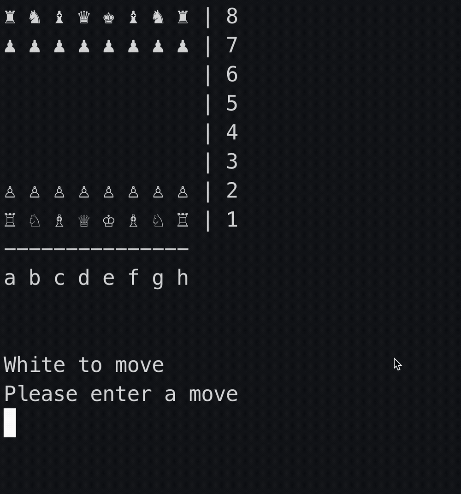

# Yggdrasil
Bitboard chess engine with Monte Carlo Tree Search, written in C++
> "Yggdrasil: an immense and central tree in Norse mythology; it is the tree of life, encompassing all nine worlds"

## Demo

## Running the engine
1. Clone the repo
2. `cd yggradasil`
3. `mkdir build`
4. `cd build/`
5. `cmake -Dtest=OFF -Dsimul=OFF..;make`
6. `./driver`

> Developed on Apple Silicon. For issues running on macOS set the environment variable `MallocNanoZone` to `0`
